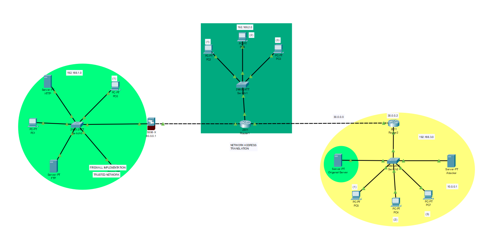
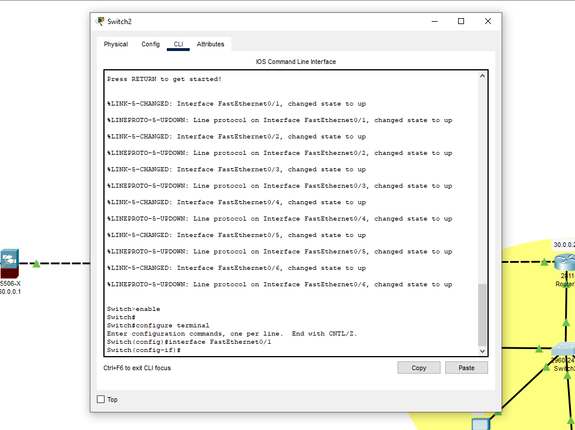
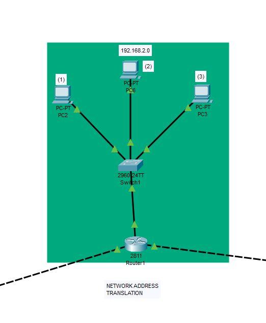
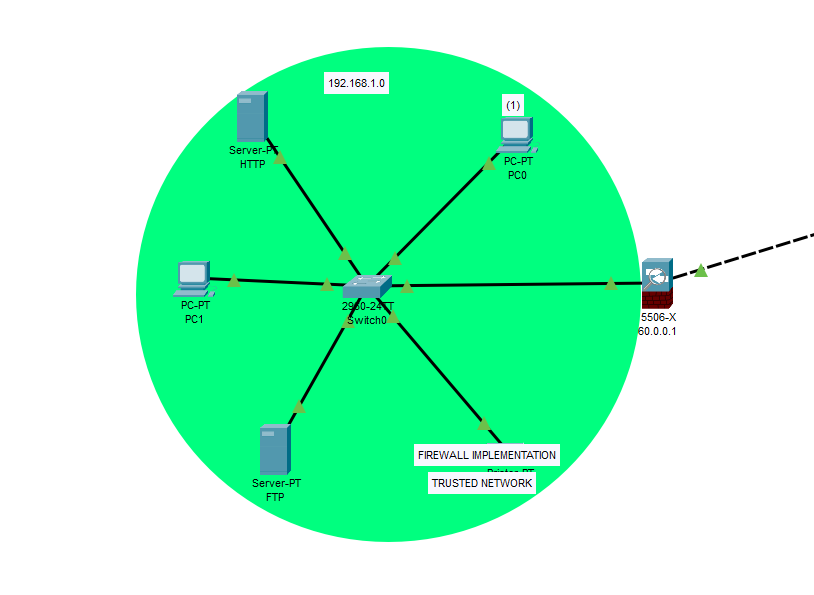
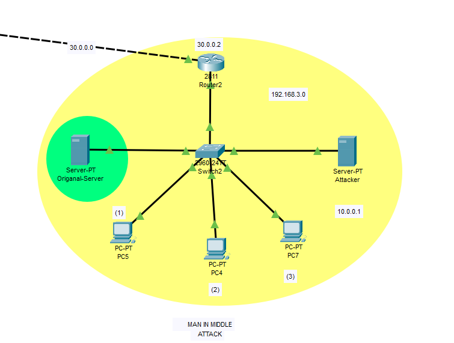

# Network Security (Vulnerabilities, Threats and Countermeasures)

This project aims to provide an overview of network security, including common vulnerabilities and threats, as well as countermeasures that can be taken to secure a network.
Installation

To use this project, you will need to install Cisco Packet Tracer. You can download the software from the official Cisco website, and installation instructions are provided in the software package.
# Usage

This project is intended to serve as an educational resource for those interested in learning about network security. The project covers topics such as common network vulnerabilities (e.g. denial-of-service attacks, malware, and social engineering), common network threats (e.g. unauthorized access, data theft, and phishing), and countermeasures that can be taken to secure a network (e.g. firewalls, intrusion detection systems, and access controls).

Here are some brief notes on how a network works:

   A network is a collection of devices that are connected to each other through a communication medium, such as cables or wireless signals.
    Devices on a network can communicate with each other by sending packets of data over the network.
    Each device on a network has a unique identifier, known as an IP address, which is used to route data to the correct destination.
    Networks can be classified based on their size and scope, such as local area networks (LANs), wide area networks (WANs), and the internet.
    Networks can be secured using a variety of techniques, including firewalls, encryption, access controls, and network monitoring tools.
# ⭐️ Complete Project look like

# 👉🏻 DHCP

# 👉🏻 Network Address Translation

# 👉🏻 Firewall Implementation Trusted Network

# 👉🏻 Man in The Middle Attack 

⚡️ This project was created by Rohit Chaudhary , Naman , Vishnu Kumar.

# Contact

If you have any questions or feedback about this project, please contac at [rohitcoc245@gmail.com].
